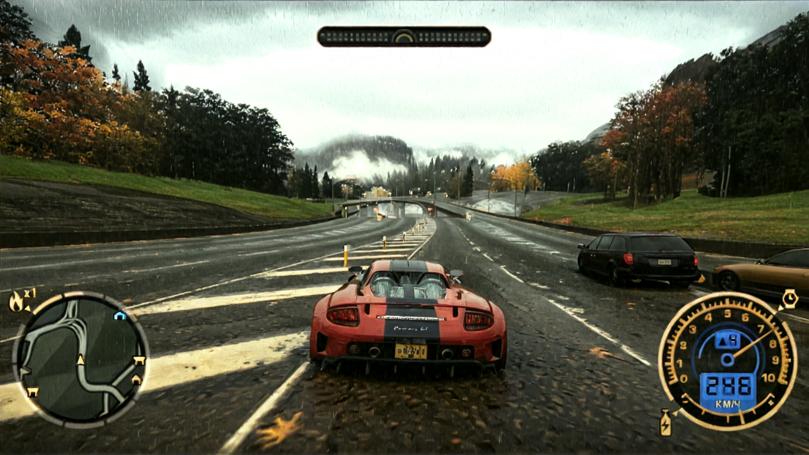
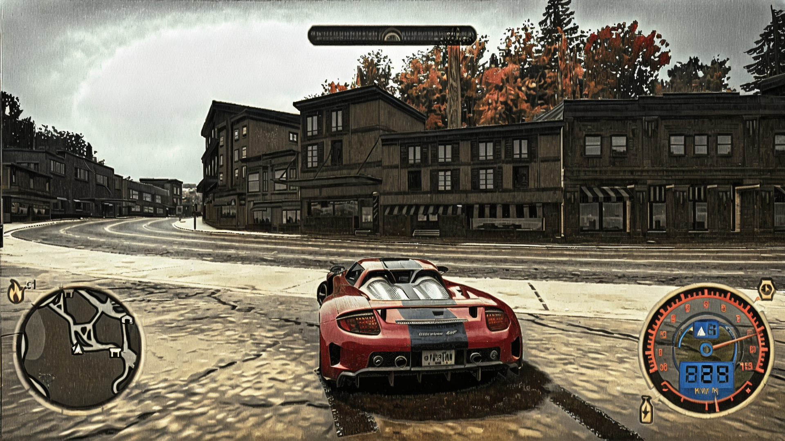
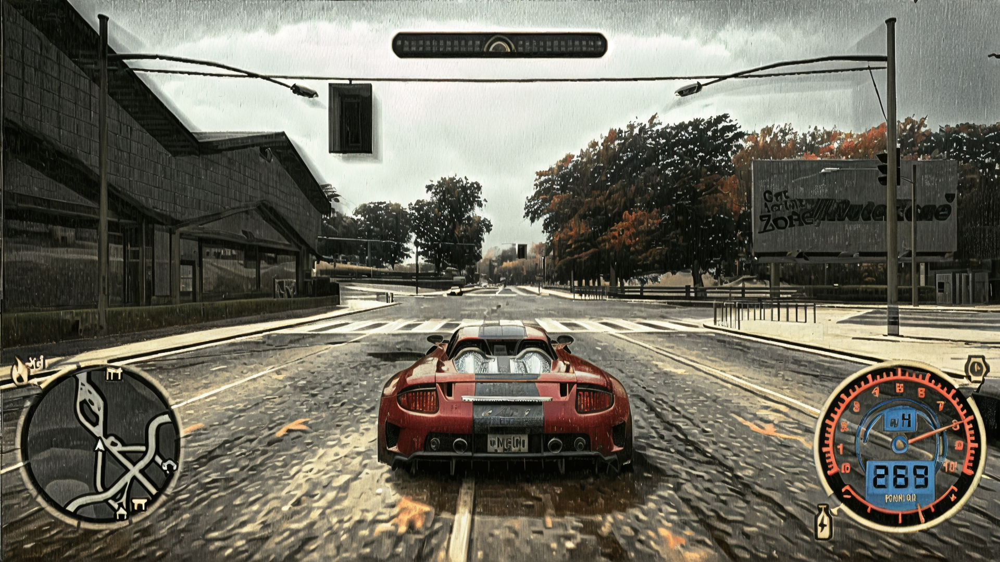
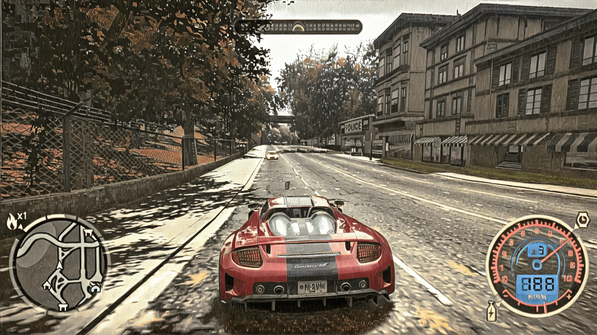
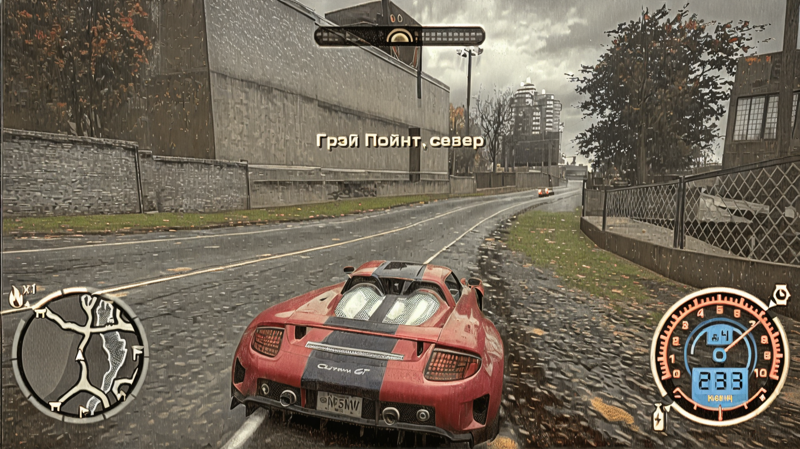
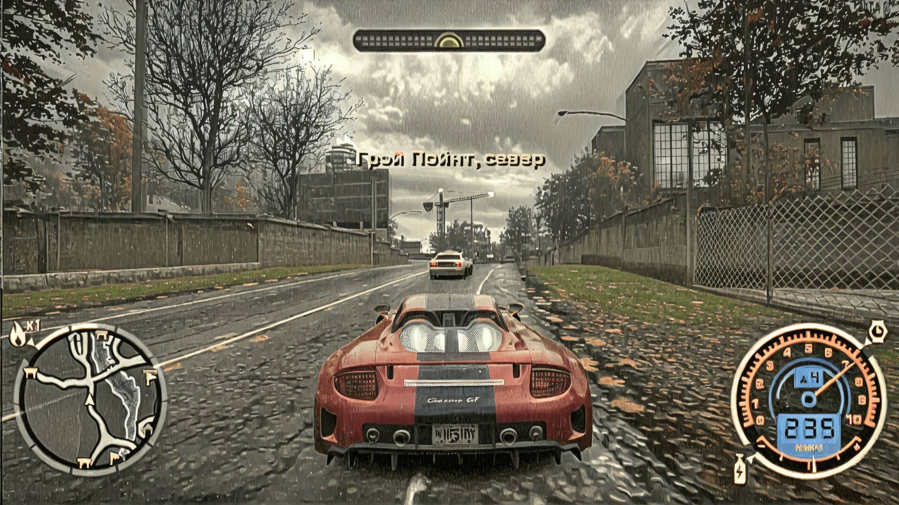

# AUTO GAME REMASTER
- [EN (auto translated)](./README_EN.md)
- [RU](./README.md)

## 02.01.25 (showcase 9)
Я сгенерил новый датасет на 49.5k изображений в разрешении 1920х1080, в сжатом состоянии получилось около 95.5GB, больше не смог, закончилась память на диске в процессе создания 😭. Чтобы автоматизировать создание датасета я использовал следующий пайплайн: запускаем comfyui сервер на нужном порте и карте, а потом при помощи [python скрипта](showcases/showcase_9/process_folder.py) посылаем запросы к нему, предварительно автоматически меняя пути к картинкам в отсылаемом  json пайплайне. Так как генерация этого датасета заняла около 2 дней, то без запуска обработки в фоне, я бы устал фиксить случайные ошибки в результате разрыва соединения и тд. в общем мастхев для длительных тасок. 
Местами изображения получились ABSOLUTE CINEMA.
- 

Потом я попробовал снова обучить InstructPix2Pix, подождал 10631 шагов с batch_size=4,gradient_accumulation_steps=8 ([график обучения тут](https://wandb.ai/dimweb/instruct-pix2pix/runs/mseqvltf), [модель тут](https://huggingface.co/dim/nfs_pix2pix_1736384110_step10500), [код запуска тут](showcases/showcase_9/inference_pix2pix.ipynb)). Однако к сожалению на инференсе изображения получаются слишком засвеченными с количеством шагов в 20-30, а что-то нормальное получается после 100. Так что возможно в прошлый раз, дело было не в количестве данных. Но после применения LCM, нормальная картинка стала появлятся уже после 15 шагов(реалтаймом тут не пахнет). Короч больше вопросов чем ответов. Но есть и плюсы, версия которая дистиллировала исходный пайплайн уменьшила деформацию объектов, но добавила мигание(думаю тому причиной LCM). Главная ценность данного эксперимента в том что используя подобные методы я могу получить практически идентичную картинку более малой моделью без использования кенни фильтров, нормал мапов, ip адаптеров, лор, контролнетов и прочего. Просто img2img. Прикладываю видео с использованием LCM.
- <video src="https://github.com/user-attachments/assets/a1bab117-8743-431a-a48b-f210c50bd608" width="50%" controls autoplay loop></video>

После этого я понял что нужно двигаться в сторону одношаговой pix2pix диффузии. Одна из таких работ это [img2img-turbo](https://github.com/GaParmar/img2img-turbo). Данная работа использует [stabilityai/sd-turbo](https://huggingface.co/stabilityai/sd-turbo), одношаговый DDPMScheduler и (к сожалению) немного измененную архитектуру форварда vae со skip connections. К сожалению, потому что это сделало его несовместимым по умолчанию с torch compile и другими решениями по ускорению. Думаю попробовать вообще выкинуть его. Попробовал обучить его с batch_size=2 gradient_accumulation_steps=16 количество шагов 7263. Вроде бы как на трейне, если смотреть на картинки в [графике обучения](https://wandb.ai/dimweb/train_pix2pix_turbo/runs/4fjvgh49), то сходство почти идеальное. Но вроде как после 5000 не было смысла больше ждать. Единственное что меня смущает это она не выучивает мелкие детали(например листвы) что немного портит картинку.
Однако данная модель полностью пофиксила тряску и деформацию тестового и тренировочного датасета. Далее привожу пример запуска: **bfloat16**, **float32** на тесте, **float32** на трейне. float32 как по мне лучше, конечно, я же в нем учил :) 

- <video src="https://github.com/user-attachments/assets/04e1b8b1-d1eb-49c2-b6ba-47e984b0aa0e" width="50%" controls autoplay loop></video>
- <video src="https://github.com/user-attachments/assets/2de99b45-ebb7-411b-bcc6-fa78e86b91b0" width="50%" controls autoplay loop></video>
- <video src="https://github.com/user-attachments/assets/2f25b7ae-3906-40fe-a3f1-2d92d16214db" width="50%" controls autoplay loop></video>

Насчет реалтайма из коробки тут намного лучше, на данный момент она работает в 15.6 fps на 4090. Примерно столько мне выдает [StreamDiffusion](https://github.com/cumulo-autumn/StreamDiffusion) в eager mode, а в tensorrt с похожей моделью 33 fps, что в 3 раза меньше чем они заявляют. Наверное дело в изменившемся API tensorrt, надо дебажить. 
Модель работает медленно, как это обычно бывает, скорее всего дело из-за излишнего оверхеда со стороны вызова cuda kernels, надо прочекать модель на graph breaks и переписать нормально на torch compile. Также во всех этих моделях используется текстовый энкодер(мне он не нужен совсем, поэтому его надо выкинуть), а также unet с обуславливанием на данные скрытые состояния от энкодера. Я пока мало разбираюсь в мат части, но почему нельзя заменить unet на скажем [squeezenet](https://arxiv.org/abs/1602.07360) или [MobileNetV3](https://arxiv.org/abs/1905.02244), а vae на [TAESD](https://huggingface.co/madebyollin/taesd)? Наверное на то есть причины... Что ж, следующий этап это изучение графика вызовов cuda kernels.

## 02.01.25 (showcase 8)
- [Воркфлоу для HunyuanVideo](showcases/showcase_8/nfs_hunhyuan_rf_inversion_testing_02.json)
- [Воркфлоу для LTXV](showcases/showcase_8/nfs_ltx_flow_edit_1.json)
- [Воркфлоу для извлечения только игровой картинки](showcases/showcase_8/nfs_extract_game_render.json)

- <video src="https://github.com/user-attachments/assets/0723e029-918d-46fe-a07e-9e5900316693" width="50%" controls autoplay loop></video>
- <video src="https://github.com/user-attachments/assets/e0887e97-1249-4a0e-a0a1-cfa9415c9aba" width="50%" controls autoplay loop></video>

С момента последней публикации успели выйти новые видеомодели [HunyuanVideo](https://github.com/Tencent/HunyuanVideo) и [LTX-Video](https://github.com/Lightricks/LTX-Video). Я дал им время настояться и обзавестить врапперами([HunyuanVideoWrapper](https://github.com/kijai/ComfyUI-HunyuanVideoWrapper), [LTXTricks](https://github.com/logtd/ComfyUI-LTXTricks)) и разрешить первые баги. Вроде как на реддите появлялось много примеров о возможности редактирования видео, но у меня адекватно не получилось это завести да и контроллируется плохо. 

Однако видеомодели довольно неплохо справляются с задачей сглаживания видео которое выходит из под SDXL, такая альтернатива Venhancer. Но как по мне лучше всего справляется на данный момент Hunyuan, но он работает очень долго даже на 4090, а LTXV быстро, но мыльно, хотя там столько гиперпараметров что может я чего не докрутил еще. [Воркфлоу для HunyuanVideo](showcases/showcase_8/nfs_hunhyuan_rf_inversion_testing_02.json). [Воркфлоу для LTXV](showcases/showcase_8/nfs_ltx_flow_edit_1.json).

Главной моей задачей остается реалтаймовый нейрорендер. Одним из примеров реалтайма(на 4090) является SD1.5, как удачно что я нашел необходимую мне медодику для этой модели - [InstructPix2Pix](https://github.com/timothybrooks/instruct-pix2pix). Это максимально простой и прямолинейный подход. На вход нейронке подается исходное изображение и текст с указанием что мы хотим сделать, а в качестве таргета для оптимизации идет конечное изображение. И как удачно что мой прошлый пайплайн производит неограниченное количество параллельных кадров игры и их стилизованную версию.

Я попробовал взять исходный скрипт из diffusers и потренить на этих данных, выставив количество шагов примерно в 10 раз меньше, чем предлагают авторы и получил хорошие proof-of-concept результаты. Я считаю когда тренировочных примеров будет не 852, а скажем в 100 раз больше, что вполне реализуемо, то результаты будут идентичны оригинальному пайплайну. [Модель тут](https://huggingface.co/dim/nfs_pix2pix_1735772517). [Датасет тут](https://huggingface.co/datasets/dim/nfs_pix2pix_1920_1080_v5). [Как это инферить можно найти тут](showcases/showcase_8/inference_pix2pix.ipynb).

После того как получится сгенерить большее количество данных думаю посмотреть в сторону [LCM](https://github.com/quickjkee/instruct-pix2pix-distill) который позволяет значительно сократить количество шагов инференсе без потерь. А еще взять в качестве базовой модели [tiny stable diffusion](https://huggingface.co/blog/sd_distillation).

- **Результат стилизации на тренировочных данных**
- 
- 
- 

- **Результат стилизации на тестовых данных**

Результат как видно не сильно отличается от трейна, несмотря на такой малый датасет.

- 
- 

## 25.11.24 (showcase 7)
- <video src="https://github.com/user-attachments/assets/73b8633b-f8aa-4277-959f-56ed93f43ca5" width="50%" controls autoplay loop></video>
- <video src="https://github.com/user-attachments/assets/4f063590-dedf-42fe-a1bc-8af3dc3005a1" width="50%" controls autoplay loop></video>

Понизил уровень шума в VEnhancer до 5 и увеличил параметр s_cond до 2. Сделал fps на выходе и входе равными, это дало мне возможность сохранить пареллельные SDXL изображения. Затем попробовал смешать асфальт из выхода SDXL с VEnhancer, с этим очень сильно помог компонент "Mask Gaussian Region", он сделал смешение картинок очень плавным. Еще попробовал применить фильтр смешения через цвет для растительности, на отдельных кадрах удалось вернуть цвет из SDXL, но на видео как по мне это добавило больше ряби, но зато убрало желтизну.

## 22.11.24 (showcase 6)
- <video src="https://github.com/user-attachments/assets/b23d3a1a-7df9-44e7-9859-3b7947465115" width="50%" controls autoplay loop></video>
- <video src="https://github.com/user-attachments/assets/860c9be3-bb3a-4d3f-8ef3-219b75d64885" width="50%" controls autoplay loop></video>
- <video src="https://github.com/user-attachments/assets/5bf734cd-b84e-4463-a4cd-2d9728534686" width="50%" controls autoplay loop></video>

Случайно узнал что шейдеры глубины не работают с reshade, если включено сглаживание в игре. Отключил, заработало. Написал по этому поводу canny шейдер, который берет за основу normal map, это позволило получить очень четкие грани на 3D объектах. Потом применил control nets для canny фильтров на основе обычной картинки из игры, картинки canny с normal map и сам normal map. В результате автомобили больше не появляются из неоткуда случайно, их очертания уже видны из далека. И в целом это наконец подходит стилистике фото, снятых на айфон первых версий или старую камеру из 2000-2004.

Скорее всего деревья не получится сделать более детальными, иначе тогда они будут отличаться от кадров и не учитывать движение игрока, в целом как и все остальные объекты. Максимум что можно улучшить это тектуру асфальта и автомобиля, которым мы управляем. Для остального уже будут нужны видео-модели.

## 17.11.24 SDXL+ControlNet+Reshade canny shader -> SAM2+Flux+Controlnet fix cars -> Venhancer -> Upscale By mask
- [sam2 fix cars workflow.json](showcases/showcase_5/nfs_fix_cars_flux_sam2.json)
- [simple upscale image by model refocus workflow.json](showcases/showcase_5/simple_model_upscale.json)
- [mix images by mask workflow.json](showcases/showcase_5/nfs_mix_venhancer_refocus.json)
- [youtube video](https://youtu.be/G4UhrLMZNVk)
- <video src="https://github.com/user-attachments/assets/c26cff8f-8f44-41a4-b47f-910aad055217" width="50%" controls autoplay loop></video>

Попробовал исправить деформацию автомобилей путем вырезки их из оригинального изображения и вставки в уже стилизованную. А потом чтобы сгладить углы я использовал FLUX на низких параметрах денойзинга с controlnet. [Ссылка](showcases/showcase_5/nfs_fix_cars_flux_sam2.json). Не сказал бы что результат стал лучше. Также после этого сгладил картинку при помощи Venhanver, и убрал мыло с нижней части картинки используя [ReFocus-V3](showcases/showcase_5/simple_model_upscale.json), чтобы создать иллюзию плохого зрения(ну типа машина и [объекты вблизи четкие, а дальше уже мыло](showcases/showcase_5/nfs_mix_venhancer_refocus.json)). 

Конечным результатом не доволен, считаю что нужно лучше дождаться нормальных controlnets для [cogvideoX](https://github.com/TheDenk/cogvideox-controlnet) или mochi-gen1, потому что как заниматься покадровой анимацией занятие тупиковое, насколько я понял смотря форумы этой тематики последний месяц.

Чтож сфокусируюсь на разработке удобного интерфейса, для того чтобы было максимально эффективно и удобно доставать и менять кадры из игры при помощи python\c++.

## 11.11.24 SDXL+ControlNet+Reshade canny shader+FLUX upscaler -> Venhancer

#### Venhancer
- [workflow.json](showcases/showcase_4/nfs_venhancer_fast.json)
- <video src="https://github.com/user-attachments/assets/0cf37ab2-e006-452f-a927-e152fef74943" width="50%" controls autoplay loop></video>
- <video src="https://github.com/user-attachments/assets/ae86346c-dcee-4a95-a307-e65c5b4392d5" width="50%" controls autoplay loop></video>

#### SDXL+ControlNet+Reshade canny shader+FLUX upscaler
- [flux upscale workflow](showcases/showcase_4/nfs_flux_upscale_controlnet.json)
- [sdxl 4 screens workflow](showcases/showcase_4/nfs_4screens_sdxl.json)
- [dataset original 4 screens](https://huggingface.co/dim/auto_remaster/blob/main/render_nfs_4screens_0.tar.gz)
- [dataset sdxl](https://huggingface.co/dim/auto_remaster/blob/main/render_nfs_4screens_1_sdxl_1.tar.gz)
- [dataset sdxl+flux upscale](https://huggingface.co/dim/auto_remaster/blob/main/render_nfs_4screens_1_sdxl_1_flux_upscale_1.tar.gz)
- 
- 
- 
- 

Разделил экран на 4 части при помощи шейдера и применил только для одного из них [canny shader](comfyui_sandbox/4Screens.fx). Конечно от этого немного пострадала точность, но картинка не слишком ухудшилась. Также попробовал применить [flux upscaler](showcases/showcase_4/nfs_flux_upscale_controlnet.json), картинка местами превратилась тупо в кино. Также попробовал поиграть с гиперпараметрами [Venhancer](showcases/showcase_4/nfs_venhancer_fast.json), убрал промпт, понизил количество шагов, по итогу картинка перестала сильно изменяться, а ждать эту обработку не полтора часа как раньше, а всего 2 минуты. Вот с таким пайплайном уже можно говорить об оффлайн рендеринге для дистилляции. Также попробовал заменить SDXL на FLUX, не получается. Картинка все время становится намного хуже, хоть и не разлетается в стороны как с SDXL, наверное отложу это на потом.

Получилось завести [PyHook](https://github.com/dwojtasik/PyHook) для Reshade. Оказывается, какой-то чел дропнул бинарь для внедрения нейронок, да и вообще любого кода в пайплайн любых игр. Увидел 10 фпс в постобработке, расстроился и пропал, я так и не нашел никакой инфы где он. Какое счастье что у меня 4090 и на дворе век победившего torch.compile. Однако пока я пробовал лишь на своей 3050ti, и это расширение дает падение фпс с 44 до 24, при работе простого Sobel фильтра на GPU c pytorch. 

Хотя не думаю что это большая проблема, главное что я теперь могу в реалтайме обрабатывать картинки из игры на pytorch и передавать их дальше. Скорость уже не так важна. Главное теперь воткнуть любую нейронку чтобы она выдавала 30фпс, а потом уже плотно заняться стабилизацией изображения.

## 07.11.24 SDXL+ControlNet+Reshade canny shader -> Venhancer

### SDXL video + Venhancer

#### Venhancer
- [workflow.json](showcases/showcase_2/nfs_venhancer.json)
- [youtube](https://youtu.be/7mpGQl7Z91k?si=XTTGQO5ZtLi6yMqI)
- <video src="https://github.com/user-attachments/assets/d623456a-8a91-4e24-a02b-0069cbb44b76" width="50%" controls autoplay loop></video>

#### SDXL
- [youtube](https://youtu.be/tdmL3rGf3NE)
- <video src="https://github.com/user-attachments/assets/959ea41b-b7dc-4217-a1d1-5d26841d2e2b" width="50%" controls autoplay loop></video>

#### Original
- [youtube](https://youtu.be/wYxjkZ3cXA8)
- <video src="https://github.com/user-attachments/assets/325fe3fd-6deb-45a0-abf1-38de7ccdb733" width="50%" controls autoplay loop></video>

### SDXL+ControlNet+Reshade
- [workflow.json](showcases/showcase_3/nfs_reshade_ip_lora_control_video_notes.json)
- [dataset](https://huggingface.co/dim/auto_remaster/blob/main/reshade_video_4.zip)
- 
- 
- 
- 

Моя гипотеза о том что canny фильтр из шейдера стабилизирует картинку оказалась верна. Пришлось заменить некоторые control nets и добавить несколько лор, чтобы сделать картинку более интересной, но теперь объекты в далеке расплываются гораздо меньше. В основном от этого страдают машины, наверное если написать шейдер который будет делать больший акцент на них, то всё решится. Также в моем пайплайне нет лор заточенных на автомобили, что могло бы(возможно) сделать их очертания более адекватными.

Проблема записи видео совместно с шейдером остается актуальной. На данный момент я написал тупой [скрипт](comfyui_sandbox/reshade_screenshot_recorder.py), который очень часто делает скриншоты через Reshade, однако даже на моем самом мощном ПК это выдает 10-12 фпс в лучшем случае. Как повысить производительность? Я думаю это можно сделать, например, через форк от Reshade и дописать функцию для записи видео, [вот тут делается скрин](https://github.com/crosire/reshade/blob/a0027100fe1eb360dcbb096f36b0a5edfa88aea1/source/runtime.cpp#L4804).

Однако это не решит того что мне не нужно применять шейдер для игрока, только взять результат вычисления.   

## 05.11.24 Venhancer, Mochi

#### Venhancer
- [workflow.json](showcases/showcase_2/nfs_venhancer.json)
- [dataset](https://huggingface.co/dim/auto_remaster/blob/main/render_nfs_noblur_high_graph_2_ip_control_lora_1.tar.gz)
- [youtube](https://youtu.be/KWcad7MjKQo)
- <video src="https://github.com/user-attachments/assets/66eb4ee4-d3bf-4190-9810-1e697165f8f2" width="50%" controls autoplay loop></video>

#### Mochi
- [workflow.json](showcases/showcase_2/nfs_mochi_enhancer.json)
- [dataset](https://huggingface.co/dim/auto_remaster/blob/main/render_nfs_noblur_high_graph_2_ip_control_lora_1.tar.gz)
- [youtube](https://youtu.be/h2xGpse_GRQ)
- <video src="https://github.com/user-attachments/assets/9633fbde-3ee5-4f51-8c66-9b032b33bb1a" width="50%" controls autoplay loop></video>

#### Original
- [youtube](https://youtu.be/UHwW8Y2Vyjs)
- [dataset](https://huggingface.co/dim/auto_remaster/blob/main/render_nfs_noblur_high_graph_2_ip_control_lora_1.tar.gz)
- <video src="https://github.com/user-attachments/assets/0454d387-4e55-4302-a9f1-4153786d03ab" width="50%" controls autoplay loop></video>

На мой взгляд [Venhancer](https://github.com/Vchitect/VEnhancer) справляется намного лучше чем mochi, хотя в обеих моделях я недостаточно экспериментировал над промптами и гиперпараметрами.

Картинка стала намного стабильнее, больше нет раздражающей ряби, однако потерялся изначальный стиль и вайб картинок. Однако я думаю это можно будет решить обычной лорой.Также мне кажется что на основе Venhancer сделать некий [refiner](https://www.reddit.com/r/StableDiffusion/comments/15ah7uj/can_someone_explain_what_the_sdxl_refiner_does/), чтобы картинка стала более интересной. Нам мой взгляд теперь стоит сосредоточиться на стабилизации картинки для control net.

## 03.11.24 SDXL+ControlNet+IPadapter+loras stack
- [workflow.json](./showcases/showcase_1/nfs_ip_control_lora_showcase_1.json)
- [dataset](https://huggingface.co/dim/auto_remaster/blob/main/render_nfs_noblur_high_graph_2.tar.gz)
- 
- 
- 
- 
- 
### videos
- 
- [video youtube, style only](https://youtu.be/fegY0VjZm1A)
- [video github](showcases/showcase_1/output.mp4)

#### Преимущества
- хорошая работа со светом
- хорошая детализация многих текстур
- очень натуральные деревья
#### Недостатки
- машины и объекты в далеке появляются и исчезают
- картинка в видео слишком скачет
- произвольное мигание цветов

#### Возможное решение
Так как картинки для controlnet производятся на основе картинки из игры, модели которые совершают это делают серьезные ошибки, так же у них нет никакой информации об объекте, которые вот вот появится на экране. Поэтому я предлагают решить это при помощи шейдера. Один из примеров лежит тут, но он у меня не работает с nfs по дефолту в reshade(https://reshade.me/forum/shader-presentation/4635-mesh-edges). Я написал какой-то супербазовый скрипт для этого, но теперь встала главная проблема. **Как одновременно получать оригинальную картинку игры и картинку примененного шейдера?** *Я не знаю*.
- Скрипт лежит тут, [comfyui_sandbox/reshade_mesh_edges.fx](comfyui_sandbox/reshade_mesh_edges.fx)

### Useful Links
- [Awesome-Video-Diffusion](https://github.com/showlab/Awesome-Video-Diffusion)
- [ComfyUI nodes for VEnhancer](https://github.com/kijai/ComfyUI-VEnhancer)
- [reshade PyHook](https://github.com/dwojtasik/PyHook)
