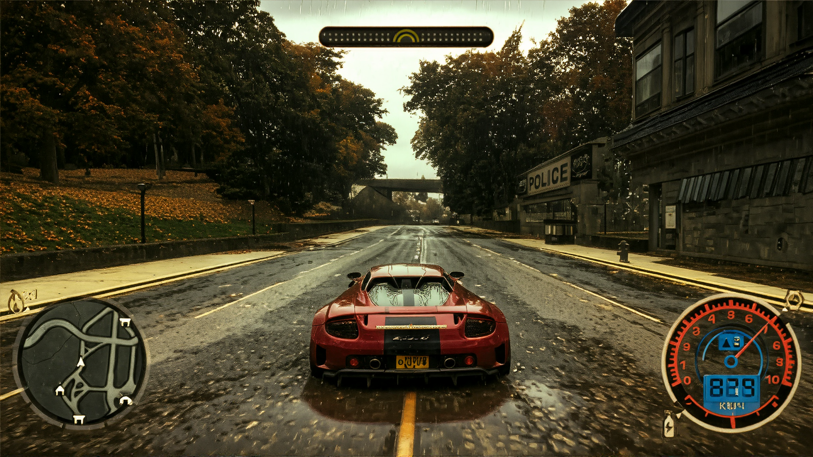
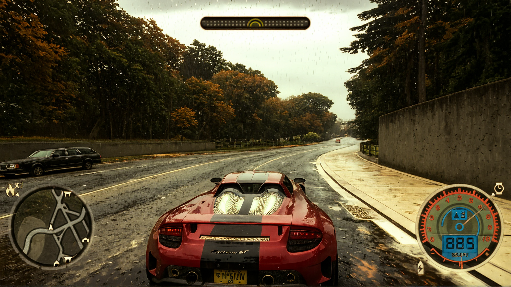
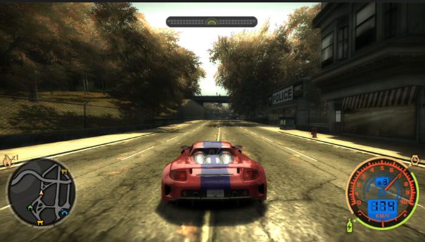
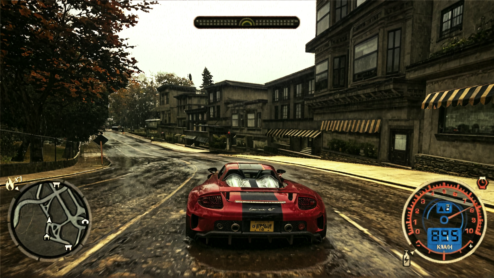
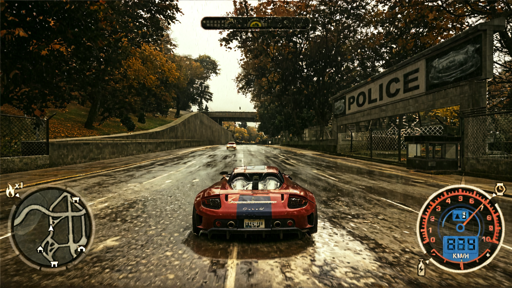
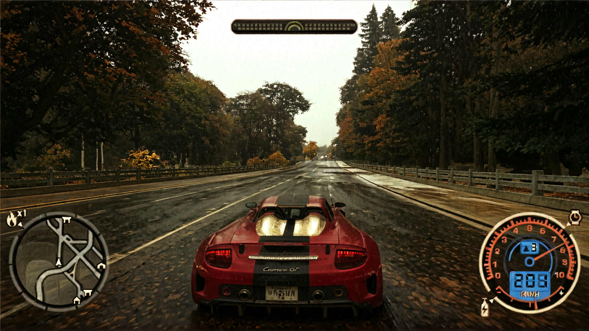
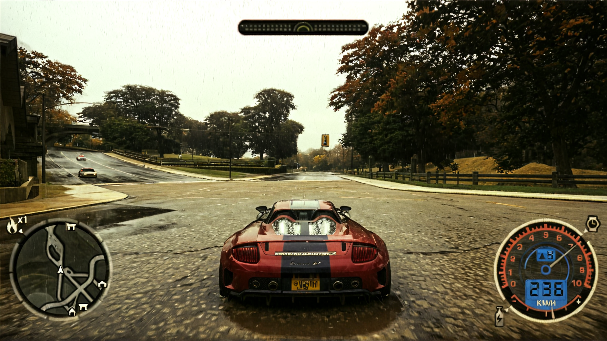

# AUTO GAME REMASTER
- [EN (auto translated)](./README_EN.md)
- [RU](./README.md)

## 22.11.24
- <video src="https://github.com/user-attachments/assets/b23d3a1a-7df9-44e7-9859-3b7947465115" width="50%" controls autoplay loop></video>
- <video src="https://github.com/user-attachments/assets/860c9be3-bb3a-4d3f-8ef3-219b75d64885" width="50%" controls autoplay loop></video>
- <video src="https://github.com/user-attachments/assets/5bf734cd-b84e-4463-a4cd-2d9728534686" width="50%" controls autoplay loop></video>

Случайно узнал что шейдеры глубины не работают с reshade, если включено сглаживание в игре. Отключил, заработало. Написал по этому поводу canny шейдер, который берет за основу normal map, это позволило получить очень четкие грани на 3D объектах. Потом применил control nets для canny фильтров на основе обычной картинки из игры, картинки canny с normal map и сам normal map. В результате автомобили больше не появляются из неоткуда случайно, их очертания уже видны из далека. И в целом это наконец подходит стилистике фото, снятых на айфон первых версий или старую камеру из 2000-2004.

Скорее всего деревья не получится сделать более детальными, иначе тогда они будут отличаться от кадров и не учитывать движение игрока, в целом как и все остальные объекты. Максимум что можно улучшить это тектуру асфальта и автомобиля, которым мы управляем. Для остального уже будут нужны видео-модели.

## 17.11.24 SDXL+ControlNet+Reshade canny shader -> SAM2+Flux+Controlnet fix cars -> Venhancer -> Upscale By mask
- [sam2 fix cars workflow.json](showcases/showcase_5/nfs_fix_cars_flux_sam2.json)
- [simple upscale image by model refocus workflow.json](showcases/showcase_5/simple_model_upscale.json)
- [mix images by mask workflow.json](showcases/showcase_5/nfs_mix_venhancer_refocus.json)
- [youtube video](https://youtu.be/G4UhrLMZNVk)
- <video src="https://github.com/user-attachments/assets/c26cff8f-8f44-41a4-b47f-910aad055217" width="50%" controls autoplay loop></video>

Попробовал исправить деформацию автомобилей путем вырезки их из оригинального изображения и вставки в уже стилизованную. А потом чтобы сгладить углы я использовал FLUX на низких параметрах денойзинга с controlnet. [Ссылка](showcases/showcase_5/nfs_fix_cars_flux_sam2.json). Не сказал бы что результат стал лучше. Также после этого сгладил картинку при помощи Venhanver, и убрал мыло с нижней части картинки используя [ReFocus-V3](showcases/showcase_5/simple_model_upscale.json), чтобы создать иллюзию плохого зрения(ну типа машина и [объекты вблизи четкие, а дальше уже мыло](showcases/showcase_5/nfs_mix_venhancer_refocus.json)). 

Конечным результатом не доволен, считаю что нужно лучше дождаться нормальных controlnets для [cogvideoX](https://github.com/TheDenk/cogvideox-controlnet) или mochi-gen1, потому что как заниматься покадровой анимацией занятие тупиковое, насколько я понял смотря форумы этой тематики последний месяц.

Чтож сфокусируюсь на разработке удобного интерфейса, для того чтобы было максимально эффективно и удобно доставать и менять кадры из игры при помощи python\c++.

## 11.11.24 SDXL+ControlNet+Reshade canny shader+FLUX upscaler -> Venhancer

#### Venhancer
- [workflow.json](showcases/showcase_4/nfs_venhancer_fast.json)
- <video src="https://github.com/user-attachments/assets/0cf37ab2-e006-452f-a927-e152fef74943" width="50%" controls autoplay loop></video>
- <video src="https://github.com/user-attachments/assets/ae86346c-dcee-4a95-a307-e65c5b4392d5" width="50%" controls autoplay loop></video>

#### SDXL+ControlNet+Reshade canny shader+FLUX upscaler
- [flux upscale workflow](showcases/showcase_4/nfs_flux_upscale_controlnet.json)
- [sdxl 4 screens workflow](showcases/showcase_4/nfs_4screens_sdxl.json)
- [dataset original 4 screens](https://huggingface.co/dim/auto_remaster/blob/main/render_nfs_4screens_0.tar.gz)
- [dataset sdxl](https://huggingface.co/dim/auto_remaster/blob/main/render_nfs_4screens_1_sdxl_1.tar.gz)
- [dataset sdxl+flux upscale](https://huggingface.co/dim/auto_remaster/blob/main/render_nfs_4screens_1_sdxl_1_flux_upscale_1.tar.gz)
- 
- 
- 
- 

Разделил экран на 4 части при помощи шейдера и применил только для одного из них [canny shader](comfyui_sandbox/4Screens.fx). Конечно от этого немного пострадала точность, но картинка не слишком ухудшилась. Также попробовал применить [flux upscaler](showcases/showcase_4/nfs_flux_upscale_controlnet.json), картинка местами превратилась тупо в кино. Также попробовал поиграть с гиперпараметрами [Venhancer](showcases/showcase_4/nfs_venhancer_fast.json), убрал промпт, понизил количество шагов, по итогу картинка перестала сильно изменяться, а ждать эту обработку не полтора часа как раньше, а всего 2 минуты. Вот с таким пайплайном уже можно говорить об оффлайн рендеринге для дистилляции. Также попробовал заменить SDXL на FLUX, не получается. Картинка все время становится намного хуже, хоть и не разлетается в стороны как с SDXL, наверное отложу это на потом.

Получилось завести [PyHook](https://github.com/dwojtasik/PyHook) для Reshade. Оказывается, какой-то чел дропнул бинарь для внедрения нейронок, да и вообще любого кода в пайплайн любых игр. Увидел 10 фпс в постобработке, расстроился и пропал, я так и не нашел никакой инфы где он. Какое счастье что у меня 4090 и на дворе век победившего torch.compile. Однако пока я пробовал лишь на своей 3050ti, и это расширение дает падение фпс с 44 до 24, при работе простого Sobel фильтра на GPU c pytorch. 

Хотя не думаю что это большая проблема, главное что я теперь могу в реалтайме обрабатывать картинки из игры на pytorch и передавать их дальше. Скорость уже не так важна. Главное теперь воткнуть любую нейронку чтобы она выдавала 30фпс, а потом уже плотно заняться стабилизацией изображения.

## 07.11.24 SDXL+ControlNet+Reshade canny shader -> Venhancer

### SDXL video + Venhancer

#### Venhancer
- [workflow.json](showcases/showcase_2/nfs_venhancer.json)
- [youtube](https://youtu.be/7mpGQl7Z91k?si=XTTGQO5ZtLi6yMqI)
- <video src="https://github.com/user-attachments/assets/d623456a-8a91-4e24-a02b-0069cbb44b76" width="50%" controls autoplay loop></video>

#### SDXL
- [youtube](https://youtu.be/tdmL3rGf3NE)
- <video src="https://github.com/user-attachments/assets/959ea41b-b7dc-4217-a1d1-5d26841d2e2b" width="50%" controls autoplay loop></video>

#### Original
- [youtube](https://youtu.be/wYxjkZ3cXA8)
- <video src="https://github.com/user-attachments/assets/325fe3fd-6deb-45a0-abf1-38de7ccdb733" width="50%" controls autoplay loop></video>

### SDXL+ControlNet+Reshade
- [workflow.json](showcases/showcase_3/nfs_reshade_ip_lora_control_video_notes.json)
- [dataset](https://huggingface.co/dim/auto_remaster/blob/main/reshade_video_4.zip)
- 
- 
- 
- 

Моя гипотеза о том что canny фильтр из шейдера стабилизирует картинку оказалась верна. Пришлось заменить некоторые control nets и добавить несколько лор, чтобы сделать картинку более интересной, но теперь объекты в далеке расплываются гораздо меньше. В основном от этого страдают машины, наверное если написать шейдер который будет делать больший акцент на них, то всё решится. Также в моем пайплайне нет лор заточенных на автомобили, что могло бы(возможно) сделать их очертания более адекватными.

Проблема записи видео совместно с шейдером остается актуальной. На данный момент я написал тупой [скрипт](comfyui_sandbox/reshade_screenshot_recorder.py), который очень часто делает скриншоты через Reshade, однако даже на моем самом мощном ПК это выдает 10-12 фпс в лучшем случае. Как повысить производительность? Я думаю это можно сделать, например, через форк от Reshade и дописать функцию для записи видео, [вот тут делается скрин](https://github.com/crosire/reshade/blob/a0027100fe1eb360dcbb096f36b0a5edfa88aea1/source/runtime.cpp#L4804).

Однако это не решит того что мне не нужно применять шейдер для игрока, только взять результат вычисления.   

## 05.11.24 Venhancer, Mochi

#### Venhancer
- [workflow.json](showcases/showcase_2/nfs_venhancer.json)
- [dataset](https://huggingface.co/dim/auto_remaster/blob/main/render_nfs_noblur_high_graph_2_ip_control_lora_1.tar.gz)
- [youtube](https://youtu.be/KWcad7MjKQo)
- <video src="https://github.com/user-attachments/assets/66eb4ee4-d3bf-4190-9810-1e697165f8f2" width="50%" controls autoplay loop></video>

#### Mochi
- [workflow.json](showcases/showcase_2/nfs_mochi_enhancer.json)
- [dataset](https://huggingface.co/dim/auto_remaster/blob/main/render_nfs_noblur_high_graph_2_ip_control_lora_1.tar.gz)
- [youtube](https://youtu.be/h2xGpse_GRQ)
- <video src="https://github.com/user-attachments/assets/9633fbde-3ee5-4f51-8c66-9b032b33bb1a" width="50%" controls autoplay loop></video>

#### Original
- [youtube](https://youtu.be/UHwW8Y2Vyjs)
- [dataset](https://huggingface.co/dim/auto_remaster/blob/main/render_nfs_noblur_high_graph_2_ip_control_lora_1.tar.gz)
- <video src="https://github.com/user-attachments/assets/0454d387-4e55-4302-a9f1-4153786d03ab" width="50%" controls autoplay loop></video>

На мой взгляд [Venhancer](https://github.com/Vchitect/VEnhancer) справляется намного лучше чем mochi, хотя в обеих моделях я недостаточно экспериментировал над промптами и гиперпараметрами.

Картинка стала намного стабильнее, больше нет раздражающей ряби, однако потерялся изначальный стиль и вайб картинок. Однако я думаю это можно будет решить обычной лорой.Также мне кажется что на основе Venhancer сделать некий [refiner](https://www.reddit.com/r/StableDiffusion/comments/15ah7uj/can_someone_explain_what_the_sdxl_refiner_does/), чтобы картинка стала более интересной. Нам мой взгляд теперь стоит сосредоточиться на стабилизации картинки для control net.

## 03.11.24 SDXL+ControlNet+IPadapter+loras stack
- [workflow.json](./showcases/showcase_1/nfs_ip_control_lora_showcase_1.json)
- [dataset](https://huggingface.co/dim/auto_remaster/blob/main/render_nfs_noblur_high_graph_2.tar.gz)
- 
- 
- 
- 
- 
### videos
- 
- [video youtube, style only](https://youtu.be/fegY0VjZm1A)
- [video github](showcases/showcase_1/output.mp4)

#### Преимущества
- хорошая работа со светом
- хорошая детализация многих текстур
- очень натуральные деревья
#### Недостатки
- машины и объекты в далеке появляются и исчезают
- картинка в видео слишком скачет
- произвольное мигание цветов

#### Возможное решение
Так как картинки для controlnet производятся на основе картинки из игры, модели которые совершают это делают серьезные ошибки, так же у них нет никакой информации об объекте, которые вот вот появится на экране. Поэтому я предлагают решить это при помощи шейдера. Один из примеров лежит тут, но он у меня не работает с nfs по дефолту в reshade(https://reshade.me/forum/shader-presentation/4635-mesh-edges). Я написал какой-то супербазовый скрипт для этого, но теперь встала главная проблема. **Как одновременно получать оригинальную картинку игры и картинку примененного шейдера?** *Я не знаю*.
- Скрипт лежит тут, [comfyui_sandbox/reshade_mesh_edges.fx](comfyui_sandbox/reshade_mesh_edges.fx)

### Useful Links
- [Awesome-Video-Diffusion](https://github.com/showlab/Awesome-Video-Diffusion)
- [ComfyUI nodes for VEnhancer](https://github.com/kijai/ComfyUI-VEnhancer)
- [reshade PyHook](https://github.com/dwojtasik/PyHook)
