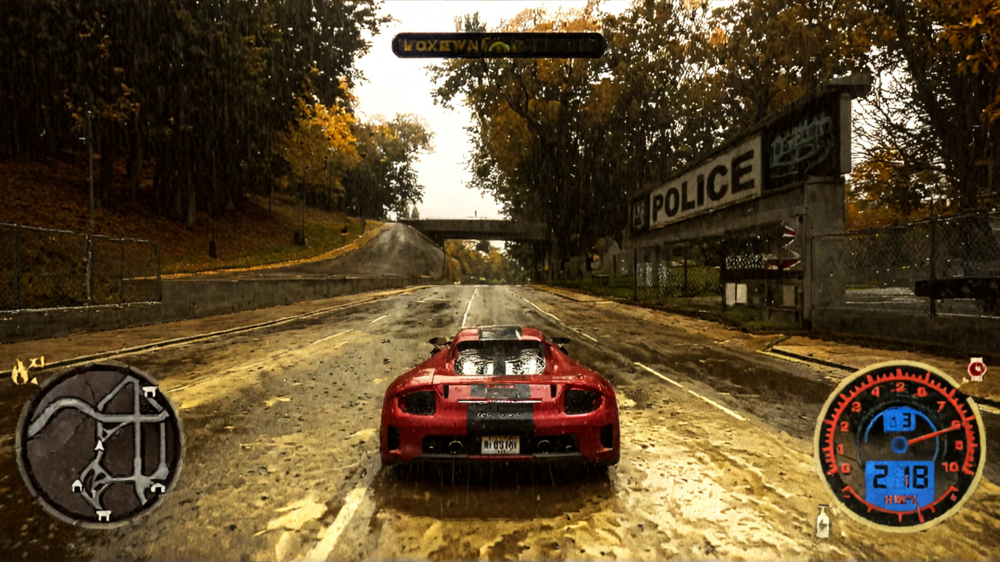

# AUTO GAME REMASTER
## 05.11.24 Venhancer, Mochi

#### Venhancer
- [workflow.json](showcases/showcase_2/nfs_venhancer.json)
- [youtube](https://youtu.be/KWcad7MjKQo)
- <video src="https://github.com/user-attachments/assets/66eb4ee4-d3bf-4190-9810-1e697165f8f2" width="50%" controls autoplay loop></video>

#### Mochi
- [workflow.json](showcases/showcase_2/nfs_mochi_enhancer.json)
- [youtube](https://youtu.be/h2xGpse_GRQ)
- <video src="https://github.com/user-attachments/assets/9633fbde-3ee5-4f51-8c66-9b032b33bb1a" width="50%" controls autoplay loop></video>

#### Original
- [youtube](https://youtu.be/UHwW8Y2Vyjs)
- <video src="https://github.com/user-attachments/assets/0454d387-4e55-4302-a9f1-4153786d03ab" width="50%" controls autoplay loop></video>

На мой взгляд [Venhancer](https://github.com/Vchitect/VEnhancer) справляется намного лучше чем mochi, хотя в обеих моделях я недостаточно экспериментировал над промптами и гиперпараметрами.

Картинка стала намного стабильнее, больше нет раздражающей ряби, однако потерялся изначальный стиль и вайб картинок. Однако я думаю это можно будет решить обычной лорой.Также мне кажется что на основе Venhancer сделать некий [refiner](https://www.reddit.com/r/StableDiffusion/comments/15ah7uj/can_someone_explain_what_the_sdxl_refiner_does/), чтобы картинка стала более интересной. Нам мой взгляд теперь стоит сосредоточиться на стабилизации картинки для control net.

## 03.11.24 SDXL+ControlNet+IPadapter+loras stack
- [workflow.json](./showcases/showcase_1/nfs_ip_control_lora_showcase_1.json)
- 
- 
- 
- 
- 
### videos
- 
- [video youtube, style only](https://youtu.be/fegY0VjZm1A)
- [video github](showcases/showcase_1/output.mp4)

#### Преимущества
- хорошая работа со светом
- хорошая детализация многих текстур
- очень натуральные деревья
#### Недостатки
- машины и объекты в далеке появляются и исчезают
- картинка в видео слишком скачет
- произвольное мигание цветов

#### Возможное решение
Так как картинки для controlnet производятся на основе картинки из игры, модели которые совершают это делают серьезные ошибки, так же у них нет никакой информации об объекте, которые вот вот появится на экране. Поэтому я предлагают решить это при помощи шейдера. Один из примеров лежит тут, но он у меня не работает с nfs по дефолту в reshade(https://reshade.me/forum/shader-presentation/4635-mesh-edges). Я написал какой-то супербазовый скрипт для этого, но теперь встала главная проблема. **Как одновременно получать оригинальную картинку игры и картинку примененного шейдера?** *Я не знаю*.
- Скрипт лежит тут, [comfyui_sandbox/reshade_mesh_edges.fx](comfyui_sandbox/reshade_mesh_edges.fx)

### Useful Links
- [Awesome-Video-Diffusion](https://github.com/showlab/Awesome-Video-Diffusion)
- [ComfyUI Infinite Upscale - Add details as you upscale your images using the iterative upscale node](https://youtu.be/t3lT_04A9j0?si=D25zicaGgGvVSX0q)
- [ComfyUI : NEW Official ControlNet Models are released! Here is my tutorial on how to use them.](https://youtu.be/DMxnf4WXMsY?si=-JslyF1_Xm08JodO)
- [How to AI Upscale with ControlNet Tiles - High Resolution for Everyone!](https://youtu.be/EmA0RwWv-os?si=FLA0WDs7DmNr3FUH)
- [Upscale from pixels to real life](https://youtu.be/kBFMKroTuXE?si=kbtXe7Lz8qrU3vBx)
- [prompt styles](https://github.com/yolain/ComfyUI-Easy-Use/blob/main/resources/fooocus_styles.json)
- [Custom nodes pack for ComfyUI This custom node helps to conveniently enhance images through Detector, Detailer, Upscaler, Pipe, and more.](https://github.com/ltdrdata/ComfyUI-Impact-Pack)
- [StreamDiffusion: A Pipeline-Level Solution for Real-Time Interactive Generation](https://github.com/cumulo-autumn/StreamDiffusion)

- [Pyramidal Flow](https://pyramid-flow.github.io/)
- [text and image to video generation: CogVideoX (2024) and CogVideo (ICLR 2023)](https://github.com/THUDM/CogVideo)
- [[ICCV 2023 Oral] "FateZero: Fusing Attentions for Zero-shot Text-based Video Editing"](https://github.com/ChenyangQiQi/FateZero)
- [Render STUNNING 3D animations with this AMAZING AI tool](https://youtu.be/8afb3luBvD8?si=0vaFe9OU684lW4Ps)
