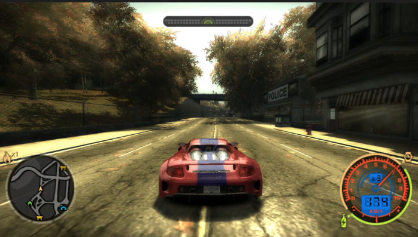

# AUTO GAME REMASTER

## 11.11.24 SDXL+ControlNet+Reshade canny shader+FLUX upscaler -> Venhancer

#### Venhancer
- [workflow.json](showcases/showcase_4/nfs_venhancer_fast.json)
- <video src="https://github.com/user-attachments/assets/0cf37ab2-e006-452f-a927-e152fef74943" width="50%" controls autoplay loop></video>
- <video src="https://github.com/user-attachments/assets/ae86346c-dcee-4a95-a307-e65c5b4392d5" width="50%" controls autoplay loop></video>

#### SDXL+ControlNet+Reshade canny shader+FLUX upscaler
- [flux upscale workflow](showcases/showcase_4/nfs_flux_upscale_controlnet.json)
- [sdxl 4 screens workflow](showcases/showcase_4/nfs_4screens_sdxl.json)
- [dataset original 4 screens](https://huggingface.co/dim/auto_remaster/blob/main/render_nfs_4screens_0.tar.gz)
- [dataset sdxl](https://huggingface.co/dim/auto_remaster/blob/main/render_nfs_4screens_1_sdxl_1.tar.gz)
- [dataset sdxl+flux upscale](https://huggingface.co/dim/auto_remaster/blob/main/render_nfs_4screens_1_sdxl_1_flux_upscale_1.tar.gz)
- 
- 
- 
- 

I divided the screen into 4 parts using a shader and applied [canny shader](comfyui_sandbox/4Screens.fx) to only one of them. While this slightly affected accuracy, the image quality didn't deteriorate too much. I also tried applying [flux upscaler](showcases/showcase_4/nfs_flux_upscale_controlnet.json), which made parts of the image look like cinema footage. Additionally, I experimented with [Venhancer](showcases/showcase_4/nfs_venhancer_fast.json) hyperparameters, removed the prompt, reduced the number of steps, and as a result, the image stopped changing significantly, and processing time decreased from one and a half hours to just 2 minutes. With this pipeline, we can now talk about offline rendering for distillation. I also tried replacing SDXL with FLUX, but it didn't work well. The image quality always becomes much worse, although it doesn't fall apart like with SDXL, so I'll probably postpone this for later.

I managed to get [PyHook](https://github.com/dwojtasik/PyHook) working for Reshade. Apparently, someone dropped a binary for integrating neural networks and any code into any game's pipeline. They saw 10 fps in post-processing, got disappointed and disappeared - I couldn't find any information about them. How fortunate that I have a 4090 and we're in the era of triumphant torch.compile. However, I've only tested it on my 3050ti so far, and this extension causes FPS to drop from 44 to 24 when running a simple Sobel filter on GPU with pytorch.

Although I don't think this is a big problem, the main thing is that I can now process game images in real-time with pytorch and pass them further. Speed isn't as important anymore. The main goal now is to integrate any neural network that can output 30fps, and then focus on image stabilization.

